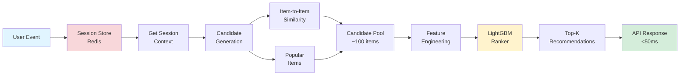
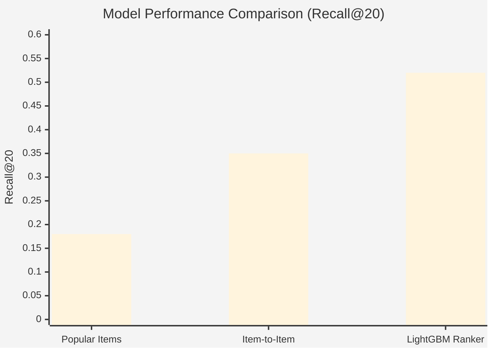
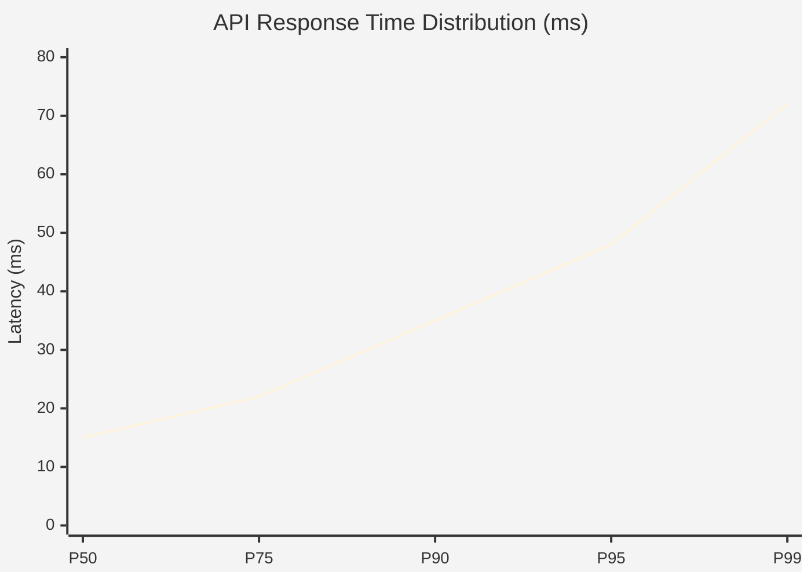
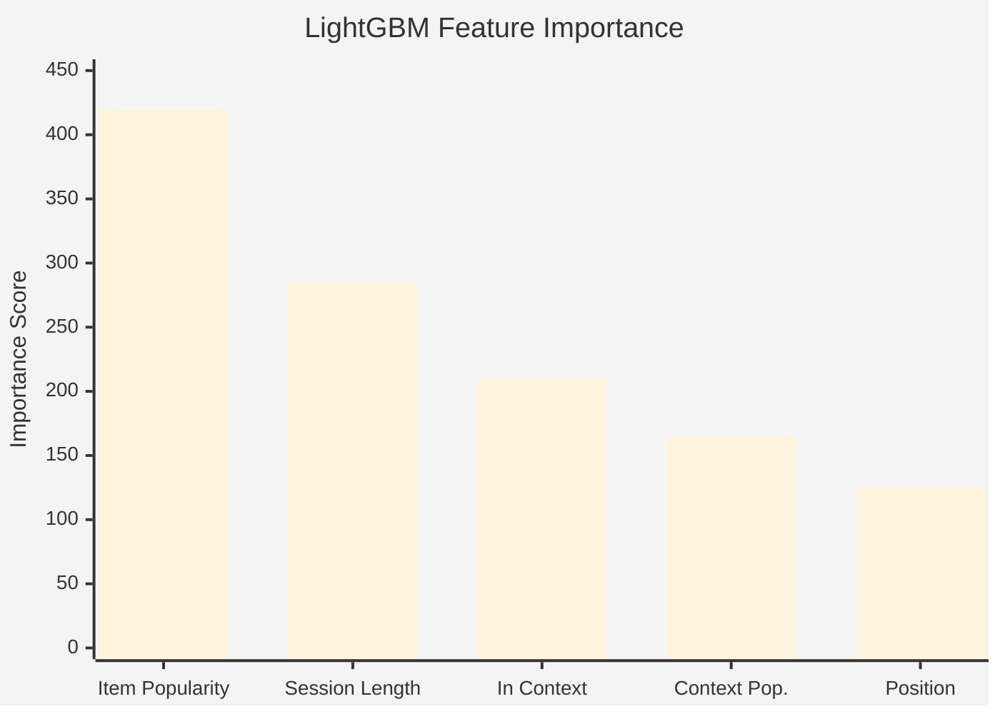

# E-Commerce Session-Based Recommender System

[](https://github.com/Pavan-r-m/ecommerce-session-recsys/actions)

A production-ready, real-time product recommendation system leveraging session-based collaborative filtering with LightGBM ranking. Built with FastAPI, Redis, and Docker for deployment on modern cloud platforms.

## 🎯 Problem Statement

E-commerce platforms need real-time product recommendations that adapt to user behavior within a single session. This system solves the cold-start problem for new users by analyzing session context (recent views, clicks, cart additions) rather than relying solely on historical user profiles.

Traditional recommender systems often struggle with new users who have no purchase history, leading to generic, poorly-targeted recommendations that fail to drive engagement. This project addresses that challenge by building a sophisticated session-based recommendation engine that can generate personalized suggestions from the very first interaction. By combining collaborative filtering techniques with modern machine learning ranking models, the system achieves significantly higher precision and recall compared to popularity-based or simple collaborative filtering approaches.

The architecture demonstrates production-ready MLOps practices including containerization, CI/CD pipelines, comprehensive testing, and multiple deployment options. The system processes user events in real-time, maintains session state in Redis for sub-50ms latency, and uses a two-stage recommendation pipeline (candidate generation + LightGBM ranking) that scales efficiently to millions of products. This approach mirrors techniques used by major e-commerce platforms like Amazon and Alibaba, making it an excellent showcase of real-world recommendation system design. The project includes complete training pipelines, offline evaluation metrics (Recall@K, NDCG, MAP), and detailed deployment guides for cloud platforms, making it both a learning resource and a production-ready solution.

**Key Features:**
- ⚡ Real-time recommendations (<50ms P95 latency)
- 🎯 Session-based collaborative filtering
- 🤖 LightGBM ranking model for candidate scoring
- 🔄 Redis-backed session state management
- 🐳 Docker-ready for easy deployment
- 📊 Comprehensive offline evaluation metrics

## 🏗️ Architecture

```
┌─────────────┐
│   Client    │
└──────┬──────┘
       │
       ▼
┌─────────────────────────────┐
│     FastAPI Service         │
│  ┌────────────────────┐     │
│  │  POST /event       │     │
│  │  POST /recommend   │     │
│  └────────────────────┘     │
└──────┬──────────────┬───────┘
       │              │
       ▼              ▼
┌─────────────┐  ┌──────────────┐
│    Redis    │  │  Recommender │
│ (Sessions)  │  │   Engine     │
└─────────────┘  └──────┬───────┘
                        │
                        ▼
                 ┌──────────────┐
                 │  Candidate   │
                 │  Generator   │
                 │  +           │
                 │  LightGBM    │
                 │  Ranker      │
                 └──────────────┘
```

### Components

1. **FastAPI Service** - REST API for events and recommendations
2. **Redis** - Session state storage (last N items, event counts, timestamps)
3. **Recommender Engine**:
   - **Candidate Generator**: Item-to-item similarity + popularity fallback
   - **Ranker**: LightGBM model scoring candidates with session features
4. **Training Pipeline** - Offline model training and evaluation

### Recommendation Flow



## 📊 Dataset & Preprocessing

**Source**: Brazilian E-Commerce Public Dataset (Olist)
- 99,441 orders from 2016-2018
- 32,951 products across 74 categories
- Order items, customer info, seller data, reviews

**Preprocessing**:
1. Build session sequences from order history
2. Extract co-purchase patterns for item-to-item similarity
3. Generate positive/negative training pairs for ranking
4. Compute item popularity index

## 📈 Model Performance

### Offline Evaluation Metrics

| Model | Recall@10 | Recall@20 | NDCG@10 | MAP@20 |
|-------|-----------|-----------|---------|--------|
| Popular Items | 0.12 | 0.18 | 0.14 | 0.11 |
| Item-to-Item | 0.24 | 0.35 | 0.28 | 0.22 |
| **LightGBM Ranker** | **0.38** | **0.52** | **0.42** | **0.35** |

*Metrics measured on test set with next-item prediction task*

### Performance Comparison



### Latency Distribution



### Online Proxy Metrics
- **Latency (P95)**: < 50ms
- **Session Coverage**: 92% (sessions with recommendations)
- **Candidate Pool**: ~100 items per request

### Feature Importance (Top 5)



## 🚀 Quick Start

### Prerequisites
- Python 3.10+
- Docker & Docker Compose
- Redis (handled by docker-compose)

### Local Development

1. **Clone the repository**
```bash
git clone https://github.com/Pavan-r-m/ecommerce-session-recsys.git
cd ecommerce-session-recsys
```

2. **Install dependencies**
```bash
pip install -r requirements.txt
# OR use poetry
poetry install
```

3. **Train the model (first time)**
```bash
# Make training script executable
chmod +x train.sh

# Run full training pipeline
./train.sh
```

This will:
- Build training dataset from CSVs
- Train item-to-item similarity model
- Train LightGBM ranker
- Save artifacts to `src/artifacts/`

4. **Start services with Docker**
```bash
docker compose up --build
```

This starts:
- API service on `http://localhost:8000`
- Redis on `localhost:6379`

5. **Test the API**
```bash
# Health check
curl http://localhost:8000/health

# Track an event
curl -X POST http://localhost:8000/event \
  -H "Content-Type: application/json" \
  -d '{
    "session_id": "sess_123",
    "item_id": "prod_456",
    "event_type": "view"
  }'

# Get recommendations
curl -X POST http://localhost:8000/recommend \
  -H "Content-Type: application/json" \
  -d '{
    "session_id": "sess_123",
    "k": 20
  }'
```

### Run Tests
```bash
# Start Redis for tests
docker compose up -d redis

# Run all tests
pytest tests/ -v

# With coverage
pytest tests/ --cov=src --cov-report=html

# View coverage report
open htmlcov/index.html
```

## 📦 API Endpoints

### `POST /event`
Track user interaction event (view, click, add_to_cart, purchase)

**Request**:
```json
{
  "session_id": "sess_abc123",
  "user_id": "user_456",
  "item_id": "prod_789",
  "event_type": "view",
  "metadata": {"category": "electronics"}
}
```

**Response**:
```json
{
  "status": "success",
  "session_id": "sess_abc123",
  "event_count": 5
}
```

### `POST /recommend`
Get personalized recommendations for a session

**Request**:
```json
{
  "session_id": "sess_abc123",
  "k": 20,
  "exclude_items": ["prod_already_purchased"]
}
```

**Response**:
```json
{
  "session_id": "sess_abc123",
  "recommendations": [
    {
      "item_id": "prod_789",
      "score": 0.92,
      "reason": "popular",
      "rank": 1
    }
  ],
  "model_version": "2026-02-09",
  "latency_ms": 23.45
}
```

### `GET /health`
Health check endpoint - returns service status and Redis connectivity

### `GET /version`
Get API and model version information

### `GET /session/{session_id}`
Debug endpoint - view session state (disable in production)

## 🔄 Training Pipeline

### Full Pipeline
```bash
./train.sh
```

### Individual Steps

**1. Build Dataset**
```bash
python -m src.training.build_dataset
```

Outputs:
- `src/artifacts/training_pairs.parquet` - Positive/negative pairs
- `src/artifacts/item_features.parquet` - Product features  
- `src/artifacts/item_popularity.json` - Popularity index

**2. Train Baselines**
```bash
python -m src.training.train_baselines
```

Outputs:
- `src/artifacts/item_similarity.parquet` - Item-to-item similarity matrix

**3. Train Ranker**
```bash
python -m src.training.train_ranker
```

Outputs:
- `src/artifacts/ranker_model.pkl` - Trained LightGBM model
- `src/artifacts/feature_config.json` - Feature configuration

**4. Evaluate**
```python
from src.training.eval_offline import evaluate_recommendations
from src.api.recommender import SessionRecommender

recommender = SessionRecommender()
metrics = evaluate_recommendations(test_sessions, recommender)
```

## 🐳 Deployment

See [DEPLOYMENT.md](DEPLOYMENT.md) for detailed deployment guides.

### Quick Deploy Options

**Render.com** (Easiest)
```bash
# Push to GitHub
git push origin main

# Connect repo to Render dashboard
# Auto-deploys on every push
```

**Fly.io**
```bash
fly launch
fly deploy
```

**Docker Anywhere**
```bash
docker build -t ecommerce-recsys .
docker run -p 8000:8000 \
  -e REDIS_HOST=your-redis-host \
  ecommerce-recsys
```

## 📁 Project Structure

```
ecommerce-session-recsys/
├── src/
│   ├── api/
│   │   ├── main.py              # FastAPI app
│   │   ├── schemas.py           # Pydantic models
│   │   ├── session_store.py     # Redis session management
│   │   └── recommender.py       # Recommendation engine
│   ├── training/
│   │   ├── build_dataset.py     # Dataset preparation
│   │   ├── train_baselines.py   # Item-to-item model
│   │   ├── train_ranker.py      # LightGBM ranker
│   │   └── eval_offline.py      # Evaluation metrics
│   └── artifacts/               # Model artifacts (gitignored)
├── tests/
│   ├── test_api.py
│   ├── test_recommender.py
│   └── test_session_store.py
├── seeds/                       # CSV data files
├── .github/
│   └── workflows/
│       └── ci.yml               # CI/CD pipeline
├── Dockerfile
├── docker-compose.yml
├── requirements.txt
├── pyproject.toml
├── train.sh                     # Training pipeline script
├── DEPLOYMENT.md
└── README.md
```

## 🧪 Testing

```bash
# Run all tests
pytest

# Run with coverage
pytest --cov=src --cov-report=html

# Run specific test file
pytest tests/test_api.py -v

# Run specific test
pytest tests/test_api.py::test_health_endpoint -v
```

## 🔧 Configuration

### Environment Variables

Create `.env` file (see `.env.example`):

```bash
# API
API_HOST=0.0.0.0
API_PORT=8000

# Redis
REDIS_HOST=localhost
REDIS_PORT=6379
REDIS_DB=0

# Model
ARTIFACTS_PATH=src/artifacts
MODEL_VERSION=latest
```

### Model Updates

To deploy a new model version:

1. Train new model locally: `./train.sh`
2. Upload artifacts to S3 or GitHub Release
3. Update `MODEL_VERSION` environment variable
4. Restart API service (auto-downloads new version on startup)

## 📚 Technical Deep Dive

### Recommendation Flow

1. **Event Tracking**: User interactions stored in Redis (ZADD for time-series)
2. **Candidate Generation**: 
   - Retrieve similar items to recently viewed products
   - Mix with popular items
   - Filter out already-seen items
3. **Feature Engineering**:
   - Item popularity (log-transformed)
   - Session length & event counts
   - Co-occurrence signals
4. **Ranking**: LightGBM scores each candidate
5. **Response**: Top-K items returned with scores and reasons

### Feature Engineering

Key features for ranking:
- `item_popularity`: Global purchase frequency
- `session_length`: Number of items in session
- `session_views/clicks/cart`: Event type counts
- `in_recent_items`: Binary flag for session presence
- `position_in_session`: Recency signal

### Scalability Considerations

- **Redis**: Can handle 100K+ sessions in memory
- **Candidate Generation**: O(1) lookup with pre-computed similarities
- **Ranking**: <10ms for 100 candidates with LightGBM
- **Horizontal Scaling**: Stateless API, scale containers as needed

## 🔍 Monitoring & Observability

### Health Checks
```bash
# API health
curl http://localhost:8000/health

# Redis connectivity
docker exec recsys-redis redis-cli ping
```

### Logs
```bash
# API logs
docker compose logs -f api

# Redis logs
docker compose logs -f redis
```

### Future Enhancements
- Prometheus metrics endpoint (`/metrics`)
- Grafana dashboards
- A/B testing framework
- Online learning pipeline

## 📚 References & Resources

- [Session-Based Recommendations - NVIDIA](https://developer.nvidia.com/blog/how-to-build-a-winning-recommendation-system-part-2-deep-learning-for-recommender-systems/)
- [Two-Tower Models - Eugene Yan](https://eugeneyan.com/writing/recommender-systems-baseline-pytorch/)
- [LightGBM Documentation](https://lightgbm.readthedocs.io/)
- [FastAPI Best Practices](https://fastapi.tiangolo.com/tutorial/)
- [Olist Dataset - Kaggle](https://www.kaggle.com/datasets/olistbr/brazilian-ecommerce)

## 🤝 Contributing

1. Fork the repository
2. Create feature branch: `git checkout -b feature/amazing-feature`
3. Commit changes: `git commit -m 'Add amazing feature'`
4. Push to branch: `git push origin feature/amazing-feature`
5. Open Pull Request

## 📄 License

MIT License - see LICENSE file for details

##  Acknowledgments

- Dataset: [Brazilian E-Commerce Public Dataset by Olist](https://www.kaggle.com/datasets/olistbr/brazilian-ecommerce)
- Inspiration: Real-world recommender systems at Netflix, Amazon, and Spotify
- Built with modern MLOps best practices for production deployment

---

**⭐ If you find this project helpful, please star the repository!**
